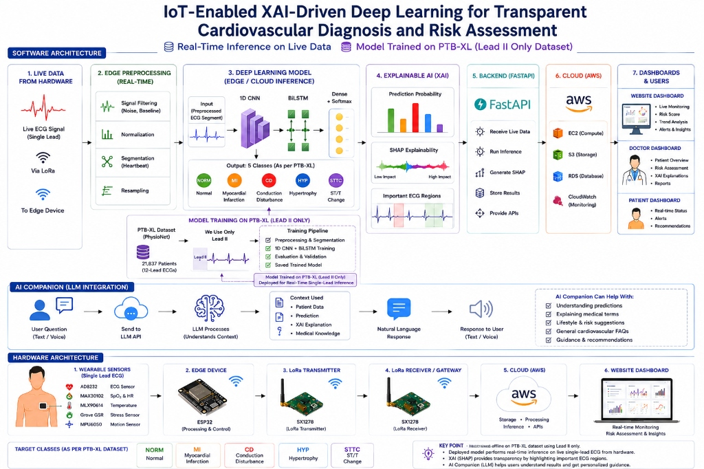
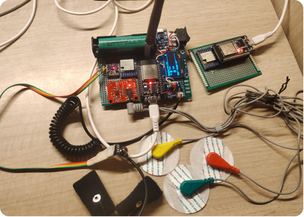
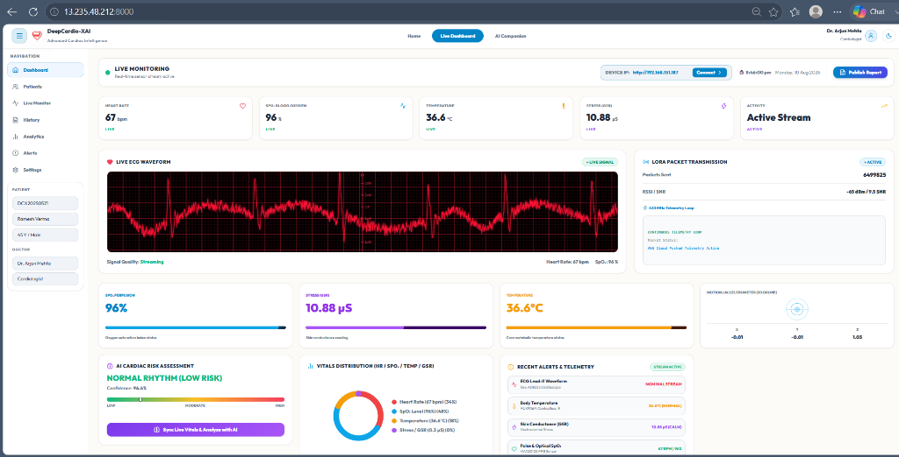

# 🫀 XAI-Driven Deep Learning for Transparent Cardiovascular Diagnosis and Risk Assessment — IoT

<p align="center">
  
  
  
  
  
  
  
  
</p>

<p align="center">
  <b>DeepCardio-XAI</b> is an end-to-end intelligent cardiac tele-monitoring system combining IoT wearable telemetry (LoRa + ESP32), high-accuracy deep learning (1D CNN + BiLSTM achieving <b>88% accuracy</b>), Explainable AI (SHAP waveform attribution), Groq LLM AI Companion (Llama 3.3 70B & Whisper v3), and an interactive clinical web platform deployed on AWS.
</p>

<p align="center">
  🌐 <b>Live Web Application:</b> <a href="http://13.235.48.212:8000/">http://13.235.48.212:8000/</a><br>
  🎥 <b>Video Demonstration:</b> <a href="https://drive.google.com/file/d/1wGAgnRML3pNX1igHM0U-9ZwjHkGgzp-m/view?usp=sharing">Watch Video Walkthrough</a>
</p>

---

## 💡 Why I Built This Project

Cardiovascular diseases (CVDs) remain the leading cause of global mortality. Traditional clinical cardiac diagnosis relies heavily on static, in-clinic 12-lead ECG machines, which cannot capture transient arrhythmias or silent ischemic events occurring during daily activities. Furthermore, existing AI diagnostic models act as opaque "black boxes," leaving cardiologists skeptical of automated risk predictions.

I built **DeepCardio-XAI** to solve these critical challenges by bridging **hardware IoT telemetry, deep learning inference, and transparent clinical explainability**:

1. **Continuous Remote IoT Telemetry:** Patients wear a lightweight ESP32-powered wearable package that continuously captures single-lead ECG, blood oxygen (SpO2), skin temperature, stress levels (GSR), and movement, transmitting signals long-range via LoRa telemetry.
2. **Noise Processing & Feature Engineering:** Raw signals undergo bandpass filtering, baseline wander removal, and extraction of morphological, time-domain (HRV metrics: SDNN, RMSSD), and frequency-domain features.
3. **High-Accuracy Deep Learning (88% Accuracy):** Preprocessed ECG segments are evaluated by a hybrid **1D CNN + BiLSTM** neural network achieving 88% diagnostic accuracy trained on PhysioNet's PTB-XL benchmark dataset.
4. **Transparent Explainable AI (SHAP Attribution):** Using SHAP (SHapley Additive exPlanations), the model quantifies the exact contribution of each feature and waveform segment (e.g., ST-segment elevation, T-wave inversion, QRS duration) toward specific disease diagnosis.
5. **Context-Aware AI Companion (Groq API):** An integrated LLM assistant powered by Groq API (Llama 3.3 70B & Whisper Large v3) translates complex cardiac metrics into plain-language summaries and lifestyle guidance for patients and clinicians.

---

## ✨ Features

* 🫀 **Multi-Vital IoT Telemetry Acquisition:** Captures real-time ECG (AD8232), Pulse Oximetry & HR (MAX30102), Body Temp (MLX90614), Galvanic Skin Response (Grove GSR), and Motion (MPU6050).
* 📡 **Long-Range LoRa Wireless Telemetry:** Uses SX1278 transceiver pairs for robust wireless data transmission from patient wearable to local edge gateway.
* 🧠 **1D CNN + BiLSTM Deep Learning Model:** Multi-class cardiac rhythm classification achieving **88% Accuracy** across 5 primary diagnostic categories (`NORM`, `MI`, `CD`, `HYP`, `STTC`).
* ⚡ **Advanced Signal Preprocessing & Feature Engineering:** Automated baseline wander elimination, bandpass noise filtering, R-peak detection, and extraction of HRV time/frequency domain metrics.
* 🔍 **SHAP Waveform & Feature Attribution:** Quantifies and visualizes exact millisecond-level contribution of ECG regions toward disease risk scores.
* 🎙️ **Multimodal AI Companion (Groq API):** Voice query input (Whisper Large v3) and text reasoning (Llama 3.3 70B) for natural conversational interaction.
* ☁️ **AWS Cloud & Dockerized Deployment:** Containerized with Docker and deployed live on AWS EC2 (`http://13.235.48.212:8000/`) with real-time streaming endpoints.
* 📊 **Clinical Grade Web Dashboard:** Real-time waveform visualizer, LoRa telemetry health metrics, risk scoring, and interactive patient history logs.

---

## 🎨 System Architecture & Workflow

Here is the architectural overview of how DeepCardio-XAI ingests live wearable signals, processes deep inference, generates SHAP explainability, and serves clinical web dashboards:



### 1. Preprocessing, Feature Engineering & Deep Model Training
Before real-time deployment, raw ECG data undergoes a rigorous processing pipeline:
* **Dataset Standardization:** 21,837 clinical 12-lead ECG recordings from PTB-XL are processed, isolating **Lead II** to mirror single-lead wearable acquisition.
* **Signal Filtering & Baseline Removal:** Digital Butterworth bandpass filtering (0.5 Hz – 40 Hz) eliminates muscle artifacts and powerline interference, while median filtering removes baseline wander.
* **Feature Engineering:**
  * **Time-Domain:** RR intervals, QRS duration, PR interval, QT interval, and HRV metrics (SDNN, RMSSD, pNN50).
  * **Frequency-Domain:** Low-Frequency (LF) power, High-Frequency (HF) power, and LF/HF ratio.
  * **Morphological Features:** Peak amplitudes of P-wave, Q-wave, R-peak, S-wave, and T-wave.
* **1D CNN + BiLSTM Network Architecture:**
  * **1D CNN Layers:** Extract local spatial morphological representations from raw lead II ECG waveforms.
  * **BiLSTM Layers:** Capture temporal sequential correlations and long-range dependencies across consecutive beats.
  * **Dense + Softmax Output:** Multi-class probability output achieving **88% Accuracy**.
* **5 Target Diagnostic Classes:**
  * **NORM:** Normal Sinus Rhythm
  * **MI:** Myocardial Infarction
  * **CD:** Conduction Disturbance
  * **HYP:** Hypertrophy
  * **STTC:** ST/T-Wave Changes

### 2. Real-Time Patient Data Inference & SHAP Explainability
When live patient data flows from the wearable device:
1. **Live Sensor Stream:** Patient ECG waveforms, SpO2, skin temperature, and GSR telemetry are continuously streamed to the FastAPI backend.
2. **Real-Time Classification:** The 1D CNN + BiLSTM model evaluates incoming 10-second ECG windows and computes disease risk probabilities.
3. **SHAP Feature & Waveform Attribution:** SHAP calculates the explicit contribution of each feature and waveform segment toward the predicted disease category:
   * **ST-Segment Elevation:** High positive contribution score toward **Myocardial Infarction (MI)** prediction.
   * **Prolonged QRS Duration:** High contribution score toward **Conduction Disturbance (CD)** prediction.
   * **T-Wave Inversion / ST Depression:** High contribution score toward **ST/T-Wave Changes (STTC)** prediction.

### 3. LLM Integration & AI Companion (Groq API)
DeepCardio-XAI integrates an intelligent multimodal conversational companion leveraging ultra-low latency **Groq Cloud Infrastructure**:
* 🎙️ **Speech-to-Text (STT):** Powered by Groq's `whisper-large-v3-turbo` model (`https://api.groq.com/openai/v1/audio/transcriptions`). Processes microphone audio input in-memory to transcribe user voice queries accurately.
* 🧠 **Text Reasoning LLM:** Powered by Groq's `llama-3.3-70b-versatile` model (`https://api.groq.com/openai/v1/chat/completions`).
* ⚡ **Real-Time Context Injection & Streaming:** Injects active patient vitals (Heart Rate, SpO2, Temp, GSR), 1D CNN diagnostic risk scores, and SHAP feature attributions into system prompt contexts. Responses stream in real-time using Server-Sent Events (SSE).
* 🔄 **Multi-Key Failover:** Features automatic API key rotation and error handling across Groq keys to ensure zero-downtime availability.
* 🗣️ **Text-to-Speech (TTS):** Vocalized audio playback for generated LLM responses.

---

## 🔌 Hardware Architecture & Sensor Setup

The DeepCardio-XAI hardware package consists of a custom wearable sensor board powered by an ESP32 micro-controller and wireless LoRa modules.

### 📷 Hardware Setup Photo


> 📁 *Detailed circuit schematic diagrams and pinout mapping table are available in the [`hardware/`](hardware/) directory.*

---

## 💻 Live Web Dashboard & Video Demo

### 🖥️ Clinical Dashboard Screenshot
The web dashboard provides real-time monitoring of incoming sensor telemetry, live ECG waveform visualization, LoRa telemetry packet health, and automated AI risk classification:



* 🌐 **Live Website Link:** [http://13.235.48.212:8000/](http://13.235.48.212:8000/)
* 🎥 **Video Demo Walkthrough:** [Watch Project Demo Video on Google Drive](https://drive.google.com/file/d/1wGAgnRML3pNX1igHM0U-9ZwjHkGgzp-m/view?usp=sharing)

---

## 📂 Repository Structure

```text
Cardivascular_project/
├── AI/                          # Deep Learning & XAI Core Codebase
│   ├── data/                    # PTB-XL & MIT-BIH dataset extractors
│   ├── feature_extraction/      # Time, frequency, and morphological feature builders
│   ├── inference/               # Real-time model predictor & XAI SHAP generator
│   ├── models/                  # 1D CNN, BiLSTM, & hybrid classifier weights
│   ├── preprocessing/          # Signal filtering, R-peak detection, & segmentation
│   ├── training/                # Training pipelines & evaluation scripts
│   └── utils/                   # Config, logging, & visualization utilities
├── assets/                      # System architecture, dashboard, & image assets
│   ├── architecture.jpg         # Full system pipeline architecture diagram
│   ├── dashboard.png            # Live web dashboard interface screenshot
│   └── hardware_photo.png       # Physical hardware circuit build photo
├── firmware_v5/                 # ESP32 C++ Firmware
│   └── firmware_v5.ino          # Arduino/ESP32 sensor acquisition & LoRa code
├── frontend/                    # Single Page React Application
│   ├── src/                     # React UI components, hooks, & state management
│   ├── package.json             # Frontend package dependencies
│   └── vite.config.js           # Vite build configuration
├── hardware/                    # Hardware Diagrams & Documentation
│   ├── README.md                # Pinout map & hardware documentation
│   ├── hardware_photo.png       # Physical prototype photo
│   ├── schematic.pdf            # Vector schematic document
│   └── schematic.png            # Rendered schematic image
├── main.py                      # FastAPI Backend server entry point
├── Dockerfile                   # Multi-stage production Docker build file
├── docker-compose.yml           # Docker deployment compose manifest
└── requirements.txt             # Python backend dependencies
```

---

## ⚙️ Local Setup & Installation

### 1. Clone the Repository
```bash
git clone https://github.com/mohitkumar-5/XAI-Driven-Deep-Learning-for-Transparent-Cardiovascular-Diagnosis-and-Risk-Assessment.git
cd XAI-Driven-Deep-Learning-for-Transparent-Cardiovascular-Diagnosis-and-Risk-Assessment
```

### 2. Create and Activate Virtual Environment
```bash
python -m venv venv

# On Windows:
venv\Scripts\activate

# On macOS/Linux:
source venv/bin/activate
```

### 3. Install Dependencies
```bash
pip install -r requirements.txt
```

### 4. Run the Backend & Frontend Application locally
```bash
python main.py
```
Open your browser and navigate to `http://localhost:8000`.

---

## 🐳 Docker Deployment

To build and run the application locally using Docker:

```bash
# Build the unified container
docker-compose build

# Start the application
docker-compose up -d
```
